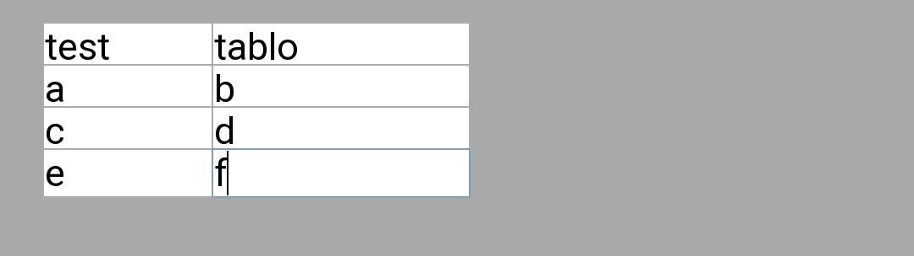
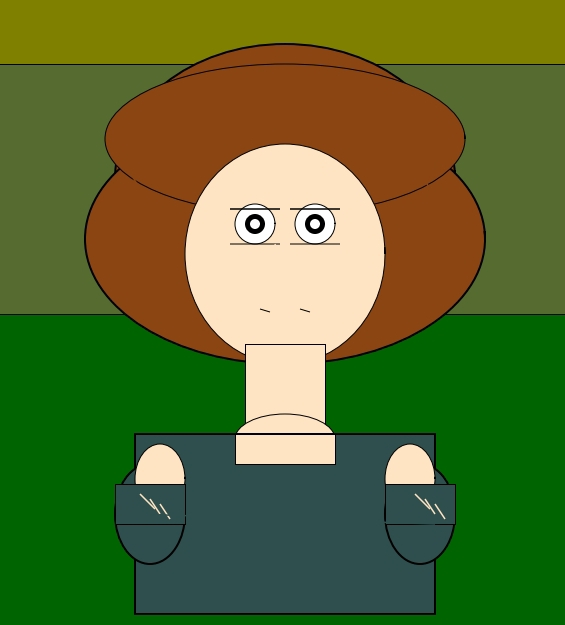

# PWR - Personal Window Recreation

**Самый простой язык программирования для творчества!**




---

## 🚀 Что это?

**PWR** — это язык программирования, созданный для быстрого создания окон, игр и приложений.  
Он написан на **Python + Tkinter** и использует простой синтаксис без лишнего кода.

### Особенности:
- ✅ **Мгновенный результат** — одна команда = одно действие
- ✅ **Простой синтаксис** — как инструкция на русском
- ✅ **Бесплатно** — всегда
- ✅ **Работает везде** — где есть Python
- ✅ **Интерактивность** — кнопки, поля ввода, диалоги
- ✅ **Графика** — холст, фигуры, картинки
- ✅ **Звук** — поддержка аудио через pygame
- ✅ **Интернет** — открытие сайтов
- ✅ **Таблицы** — для ввода данных
- ✅ **Сохранение проектов** — экспорт/импорт `.pwr`

---

## 📋 Все команды PWR

```pwr
root()                                    # Окно
rename::win::MyApp                        # Переименовать
geometry::win::400::300                   # Размер окна
msg::box::win::Hello::50::50              # Текст
msg::Hello::World                         # Диалоговое окно
color::win::red                           # Цвет
picture::my_image.png::win::50::50        # Картинка
command::net::google.com                  # Сайт
command::audio::music.mp3::1              # Звук
Gui::canvas::win::400::300::white         # Холст
canvas::figure::create_rectangle::100::100::200::200::blue::black::2
canvas::figure::create_oval::150::150::250::250::red::black::2
canvas::figure::create_line::100::100::200::200::green::3
get::text::win::100::100::Hello           # Поле ввода
command::button::text::Hello!::Click::lightblue::100::100   # Кнопка текст
command::button::net::google.com::Google::lightgreen::100::100 # Кнопка сайт
command::button::circle::win::300::200::white::Draw::lightcoral::100::100 # Кнопка круг
command::copy::win::Hello World::Copy::lightblue::100::100  # Кнопка копировать
command::open::win::https://google.com::Chrome::lightblue::100::100 # Кнопка открыть
command::msg::win::Hello::Message::lightblue::100::100      # Кнопка сообщение
copy::Hello World                         # Копировать текст
open::https://google.com                  # Открыть программу
box::data.txt::w+::Hello World            # Работа с файлами
table::3::3::my_table::win                # Таблица
console::random::1::10                    # Случайное число
console::randombox::apple::banana::cherry # Случайный выбор
export::myproject                         # Сохранить проект
import::myproject.pwr                     # Загрузить проект
#::This is a comment                      # Комментарий